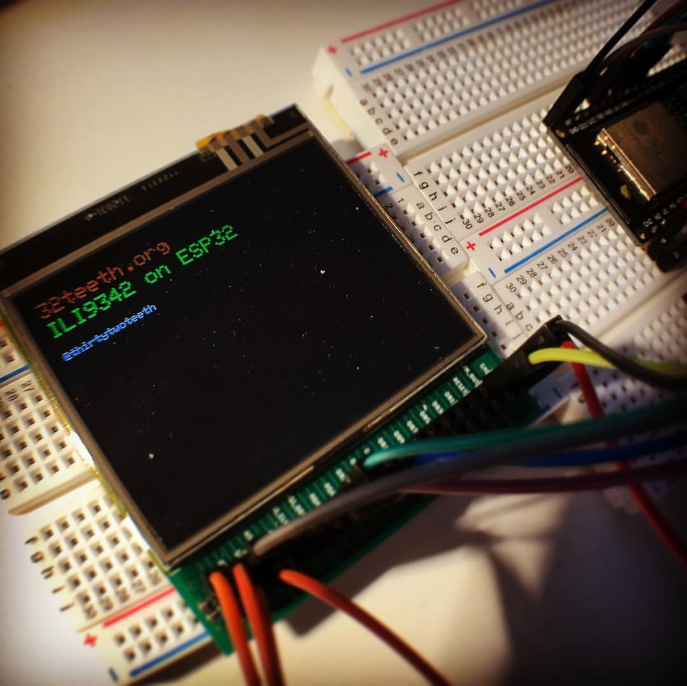
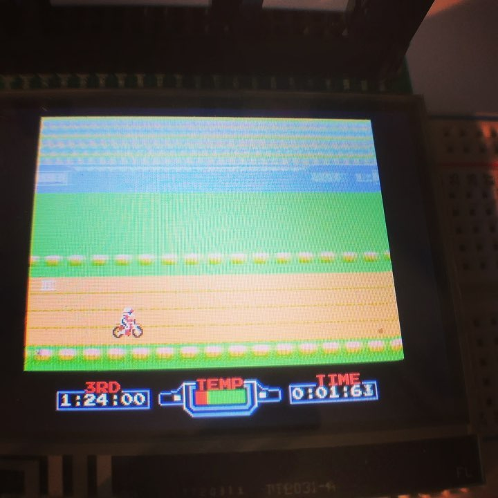

------
#### Buy Us A Coffee
> It's Not Mandatory, But Much [Appreciated](https://www.paypal.me/32teeth/1.99USD)

We work tirelessly to bring you the best **Odroid GO** and **Retro ESP32** user experience.

Everything we provide is free to use, Feedback is always welcome.

If you like what you see, and feel like giving us additional support, we accept **PayPal** donation of $1.99 USD, that's like, 1 coffee. But fee free to change the amount. We won't shy away!

*Thank You*
Retro ESP32 Team

------

# 
> An ESP32 Wrover based Game Boy Pocket

This repo contains source code, libraries for **Arduino IDE** and **Odroid GO** display drivers

## Arduino Libraries
> ILI9342 specific libraries

The standard *Arduino* libraries for both **ODROID-GO** and **Adafruit TFT** with modifications specific to the ***ILI9342*** display driver from Ilitek


#### Installation

1. Place the folders / libraires found in the [Arduino Libraries](https://github.com/32teeth/GabozeExpress/tree/master/ILI9342/Arduino%20Libraries) folder into your Arduino libraries location on your local machine
2. Restart **Arduino IDE**

### Adafruit_ILI9342
You can sipmly run the examples as they are. 
You can assign your GPIO pins as you wish!
Below is a standard example. 

```
#include "SPI.h"
#include "Adafruit_GFX.h"
#include "Adafruit_ILI9342.h"

#define _miso 19	// Not connected
#define _mosi 23  // TFT MOSI
#define _sclk 18  // TFT SCK/CLK

#define _cs   5   // TFT CS
#define _dc   21	// TFT DC
#define _led	14

#define _rst  17  // ESP RST to TFT RESET

// Use hardware SPI
Adafruit_ILI9342 tft = Adafruit_ILI9342(_cs, _dc, _rst);
```
### ODROID-GO
> GPIO pins are default Odroid Go build. Be sure to set your TFT hardware accordingly

#### TFT

| Function |   Pin |
| -------- | ----: |
| VCC      |   3V3 |
| GND      |   GND |
| MISO     |    19 |
| MOSI     |    23 |
| SCK      |    18 |
| CS       |     5 |
| DC       |    21 |
| RESET    | RESET /EN |
| LED      |    14 |

### SD CARD

| Function |   Pin | SD CARD *(Common Names)* |
| -------- | ----: |----: |
| VCC      |   3V3 | VDD / VCC|
| GND      |   GND | GND|
| MISO     |    19 | DO / DAT0|
| MOSI     |    23 | DI / CMD|
| SCK      |    18 | SCLK / CLK|
| CS       |    22 | CS / CD / DAT3|

## Odroid Go
> Get Odroid Firmware running an ILI9342

There are multiple folders in the [Odroid Drivers](https://github.com/32teeth/GabozeExpress/tree/master/ILI9342/Odroid%20Drivers/)  folder, please use as necessary

### odroid-go-firmware
This extends the display drivers from [OtherCrashOverride's](https://github.com/OtherCrashOverride/odroid-go-firmware) firmware for the [Odroid GO](https://www.hardkernel.com/shop/odroid-go/)

Overwrite the following files in your local Odroid Firmware *main* folder
```
/main/odroid_display.h
/main/odroid_display.c
```

Compile your firmware.
```
make
```

Compile and flash firmware.
```
make flash
```

### odroid-go-common
If you are building application / firmware on top of **odroid-go-firmware** you will most likely be using the **odroid-go-common** linked folder as in example of the **go-play** firmware or emulators

Overwrite the following files in your local Odroid Firmware *components/odroid* folder
```
/main/odroid_display.h
/main/odroid_display.c
```

### Examples



